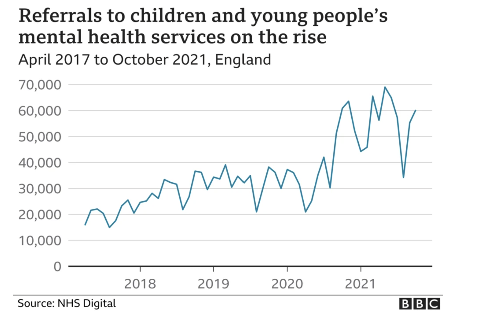

Hey everyone,

I found an article in the BBC discussing the effects of the pandemic on mental health referrals to specialists for children under the age of 18. The graph depicts a slight growing trend between the years of 2017-2020, followed by a steep incline in referrals during the early stage of the pandemic.

Upon first glance the message is conveyed well; there were significantly fewer referrals in a pre-pandemic era, even comparing the dips in data points between the years of 2020-2021, it still doesn't reach the peaks of previous years. However, looking closer at the graph I believe that the presentation of the data is quite hard to follow.

One issue is that the article mentions there being 349,449 referrals in October 2021, but the x-axis does not reflect this number and the scale used in the graph is unclear. Additionally the lack of markings between the years, make it difficult to read the specific time period. When the title of the graph is between April 2017 to October 2021, ideally, there would be easily identifiable points that refer to those time periods 

While the graph is successful in conveying its message, it would benefit from more clearly defined data points and a defined scale. Annotating the specific months would provide better insight as to when mental health specialists are in high demand, as there are major dips and peaks by +/- 10,000 referrals.